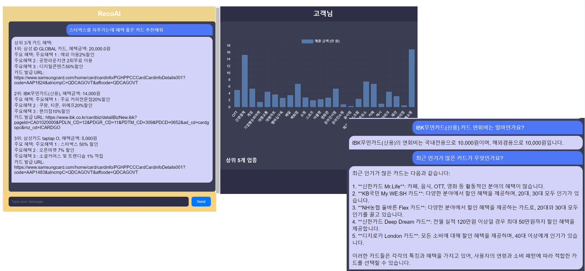
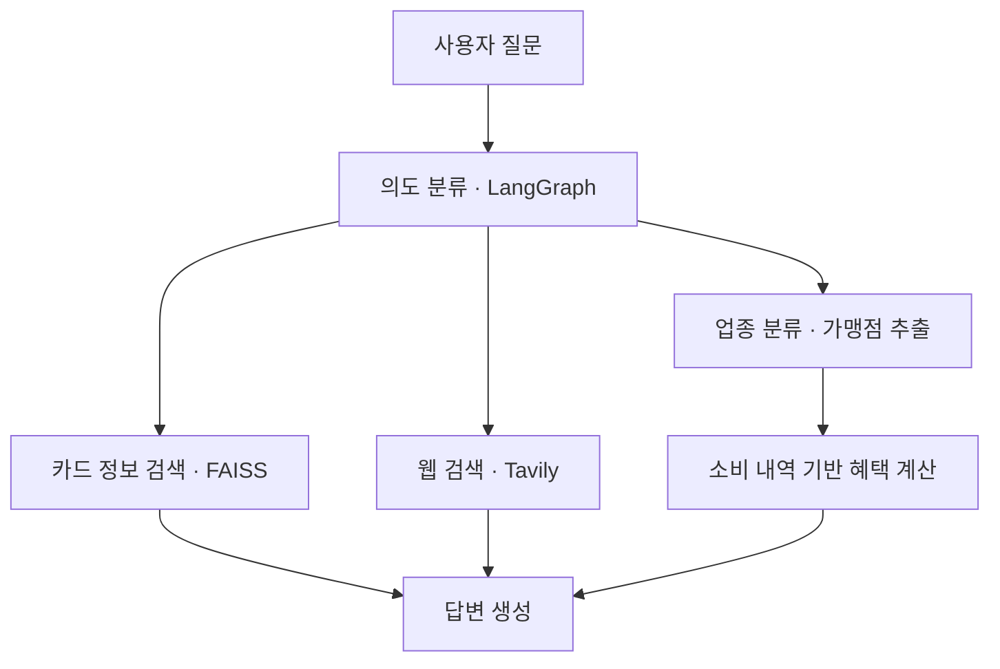

# RecoAI — 소비 내역 기반 카드 추천 챗봇

> 카드 혜택 정보와 사용자의 소비 내역을 활용해 예상 혜택을 계산하고, 자연어 질문에 맞는 카드를 추천하는 서비스입니다.

## 1. 프로젝트 개요

카드마다 전월 실적, 할인 대상, 할인 방식, 한도가 달라 사용자가 자신의 소비 패턴에 적합한 카드를 비교하기 어렵습니다.

RecoAI는 이러한 혜택 정보를 구조화하고, 소비 내역 분석과 자연어 질의응답을 연결하여 카드 선택을 돕는 팀 프로젝트입니다.

| 항목 | 내용 |
|---|---|
| 개발 기간 | 2024.11.21 ~ 2024.12.27 |
| 팀 구성 | 5명 |
| 본인 담당 | 카드 혜택 데이터 수집·구조화, 업종 분류 모델 개발, 가맹점명 추출 |
| 프로젝트 형태 | 멋쟁이사자처럼 자연어처리 팀 프로젝트 |

[발표자료 보기](docs/presentation.pdf)

## 2. 주요 기능

| 기능 | 설명 |
|---|---|
| 소비 내역 기반 카드 추천 | 소비 내역과 카드별 혜택 조건을 바탕으로 예상 혜택을 계산하고 카드를 비교 |
| 카드 혜택 질의응답 | 카드 혜택 정보를 검색하여 자연어 질문에 답변 |
| 업종·가맹점 인식 | 질문에서 관련 업종을 분류하고 가맹점명을 추출하여 혜택 계산에 활용 |
| 웹 검색 연계 | 외부 정보가 필요한 질문을 웹 검색으로 연결 |

## 3. 시스템 구성

사용자 질문의 의도를 분류한 뒤, 카드 정보 검색·웹 검색·혜택 계산 중 필요한 처리 경로로 연결합니다.

**본인은 업종 분류·가맹점 추출과 혜택 계산에 필요한 카드 데이터 구조화를 담당했습니다.** 의도 분류, 검색·응답 흐름, 혜택 계산 로직, 웹 서비스는 팀원들이 담당했습니다.

## 4. 본인 기여

### 4.1 카드 혜택 데이터 수집 및 구조화

소비 내역으로 예상 혜택을 계산하려면 줄글 형태의 카드 설명을 조건과 수치로 나누어 저장해야 했습니다.

프로젝트 당시 카드고릴라 TOP 100 중 **50개 카드를 선별해 데이터를 수집**하고, 다음 기준으로 혜택 정보를 정리했습니다.

| 고려 사항 | 처리 방식 |
|---|---|
| 혜택마다 다른 전월 실적 조건 | 실적 조건을 그룹으로 구분 |
| 여러 업종·가맹점에 적용되는 공통 혜택 | 실적 조건과 상세 혜택이 같은 대상을 그룹화 |
| 서로 다른 혜택 단위 | 정액 할인, 비율 할인, 리터당 혜택, 이용 금액 단위별 마일리지 등을 구분 |
| 선택형 카드 혜택 | 선택지 또는 선택 조합별로 별도 카드 레코드 구성 |
| 업종·가맹점 표기 | 수집한 명칭을 가맹점 추출용 사전으로 활용 |

예를 들어 하나의 카드에서 혜택을 선택하는 경우, `카드-혜택1`, `카드-혜택2`, `카드-혜택3`처럼 레코드를 나누어 선택에 따른 조건을 표현했습니다.

### 4.2 E5 임베딩을 활용한 업종 분류

질문과 업종명의 임베딩을 결합하여 **54개 업종 중 하나를 선택하는 분류기**를 구현했습니다.

- 임베딩 모델: `intfloat/multilingual-e5-large-instruct`
- 질문 벡터와 각 업종 벡터를 결합한 뒤, 완전연결 신경망으로 업종별 점수 계산
- 임베딩은 사전에 계산하고, 분류기만 학습
- Cross-Entropy Loss와 AdamW를 사용해 학습

질문과 업종을 각각 벡터로 표현한다는 Two-Tower 아이디어를 참고했으며, 두 인코더를 함께 학습하는 방식은 아닙니다.

추가 대형 모델 도입에 따른 GPU 메모리 부담을 고려해 기존 임베딩 모델을 활용하는 방향을 선택했습니다. 메모리 절감량이나 응답 속도를 별도로 측정하지는 않았습니다.

관련 코드: [Models.py](Models.py) · [업종 분류 실험 노트북](notebooks/two_tower_embedding_test-1224.ipynb)

### 4.3 사전과 문자열 유사도를 활용한 가맹점명 추출

분류된 업종에 해당하는 가맹점 사전을 대상으로 질문과의 문자열 유사도를 계산했습니다.

- RapidFuzz의 `partial_ratio`로 질문과 가맹점명 비교
- 긴 가맹점명부터 탐색하여 포함 관계가 있는 이름의 충돌 완화
- 가장 높은 점수가 기준값 이상이면 해당 가맹점명 반환
- 기준을 충족하는 가맹점이 없으면 업종명 반환

예를 들어 `이마트`와 `이마트트레이더스`처럼 이름이 겹치는 경우 긴 이름부터 비교하도록 했습니다. 동일한 최고 점수에서는 먼저 탐색한 후보가 유지됩니다.

현재 구현은 가맹점 하나를 반환하며, 사전에 없는 가맹점이나 여러 가맹점이 포함된 질문에는 한계가 있습니다.

관련 코드: [Tools.py](Tools.py) · [가맹점 추출 실험 노트북](notebooks/category_keyword_extract.ipynb)

## 5. 실험 과정과 배운 점

업종 분류에서는 임베딩의 코사인 유사도 비교, LLM 기반 추출, 사전학습 언어모델 기반 분류 등을 시도했습니다. 이후 질문·업종 벡터를 결합하여 점수를 학습하는 방식으로 구현을 진행했습니다.

| 검토한 문제 | 시도 및 관찰 |
|---|---|
| 단순 유사도만으로 업종을 구분하기 어려움 | 질문·업종 벡터를 입력으로 받는 분류기를 학습 |
| 유사 업종 구분 및 데이터 불균형 | 부족한 업종의 질문을 추가하고 학습 결과를 관찰 |
| 카드 혜택 수집에 필요한 수작업 | GPT를 이용한 1차 구조화와 사람의 검수를 시도했으나 기대한 품질을 확보하지 못함 |

이 과정에서 모델 선택뿐 아니라 **질문의 다양성, 업종별 데이터 수, 평가 데이터의 분리**가 중요하다는 점을 확인했습니다.

실험 노트북의 정확도와 F1은 별도 검증셋 없이 학습 과정에서 계산한 값입니다. 실제 사용자 질문에 대한 일반화 성능을 의미하지 않으므로, 프로젝트 성능 지표로 제시하지 않습니다.

## 6. 기술 스택

| 영역 | 기술 |
|---|---|
| 개발 언어 | Python |
| 업종 분류 | PyTorch, Sentence Transformers, scikit-learn |
| 임베딩 | `intfloat/multilingual-e5-large-instruct` |
| 가맹점명 추출 | RapidFuzz |
| 의도 분류 | KoBERT |
| 답변 생성 | `BCCard/Llama-3.1-Kor-BCCard-Finance-8B` |
| 검색 및 흐름 제어 | LangChain, LangGraph, FAISS, Tavily |
| 웹 서버 및 데이터 처리 | Flask, SQLite, Pandas, NumPy |

## 7. 코드 및 프로젝트 자료

| 파일 | 내용 |
|---|---|
| [app.py](app.py) | 웹 서버 및 요청 처리 |
| [Graph.py](Graph.py) | 질문 처리 흐름 구성 |
| [Models.py](Models.py) | 모델 로딩 및 업종 분류기 구조 |
| [Tools.py](Tools.py) | 검색 도구, 업종 분류·가맹점 추출 연결 |
| [Reward_function.py](Reward_function.py) | 카드 혜택 계산 로직 |
| [업종 분류 노트북](notebooks/two_tower_embedding_test-1224.ipynb) | E5 임베딩 기반 분류기 학습·추론 실험 |
| [가맹점 추출 노트북](notebooks/category_keyword_extract.ipynb) | 업종 분류 결과와 가맹점 사전을 연결한 추출 실험 |
| [발표자료](docs/presentation.pdf) | 서비스 소개, 구현 과정 및 시연 화면 |

노트북은 당시 실험 코드를 바탕으로 설명과 출력을 정리한 기록입니다. 전체 실행에는 별도의 학습 데이터, 모델 가중치, 가맹점 사전 및 경로 설정이 필요합니다.

## 8. 한계 및 개선 방향

- **평가 데이터 분리:** 학습·검증·테스트 데이터를 분리하고 업종별 F1과 혼동행렬로 성능을 평가할 필요가 있습니다.
- **질문 다양성 확보:** 생성형 AI로 만든 질문의 표현 편향을 줄이고 실제 사용자의 다양한 질문을 확보해야 합니다.
- **복수 업종 처리:** 현재 단일 업종 분류를 여러 업종이 포함된 질문으로 확장하려면 다중 레이블 데이터와 평가 기준이 필요합니다.
- **가맹점 추출 개선:** 별칭과 표기 변형을 보강하고, 포함 관계가 있는 이름과 여러 가맹점의 동시 추출을 처리해야 합니다.
- **카드 데이터 품질 관리:** 혜택 조건의 누락과 표현 차이를 점검할 수 있는 스키마 및 검증 절차가 필요합니다.
